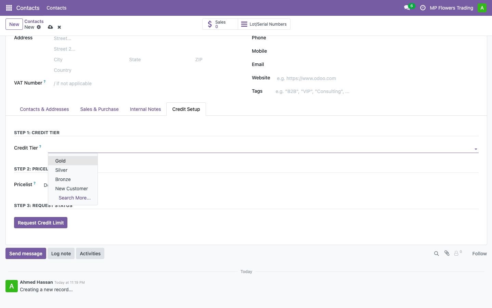
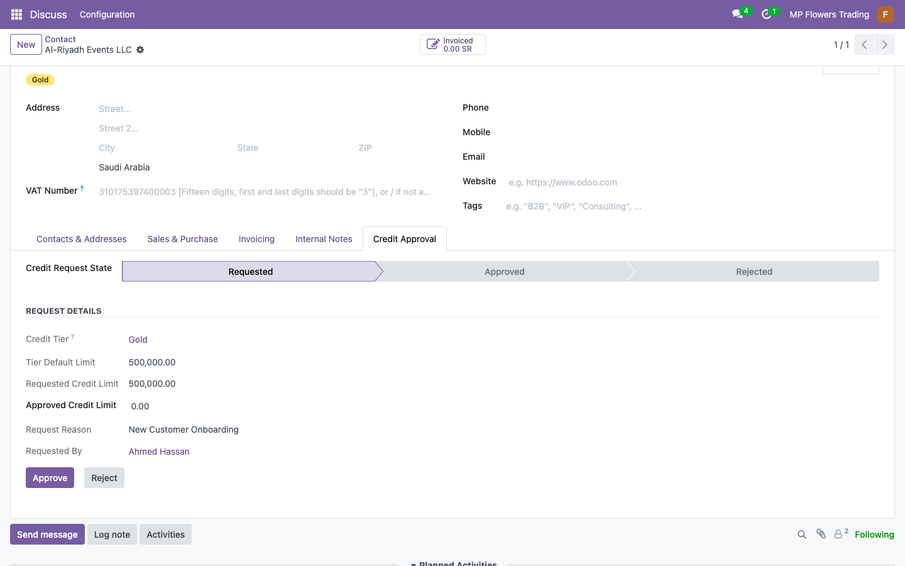
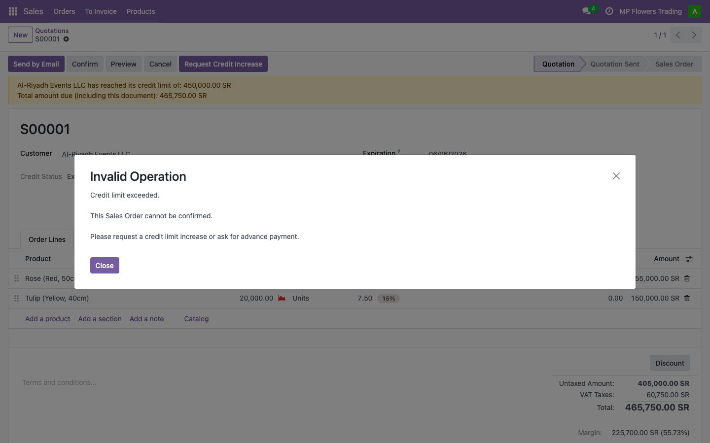
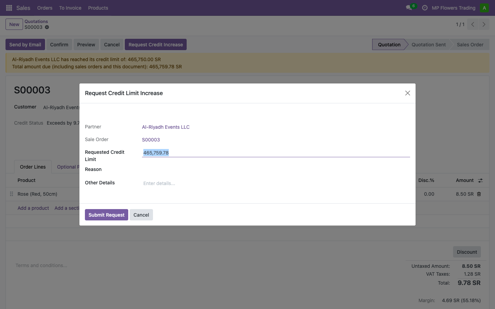
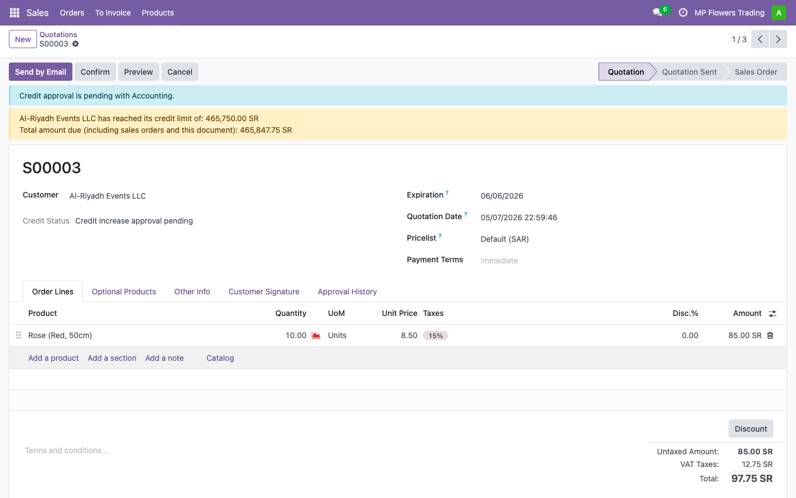
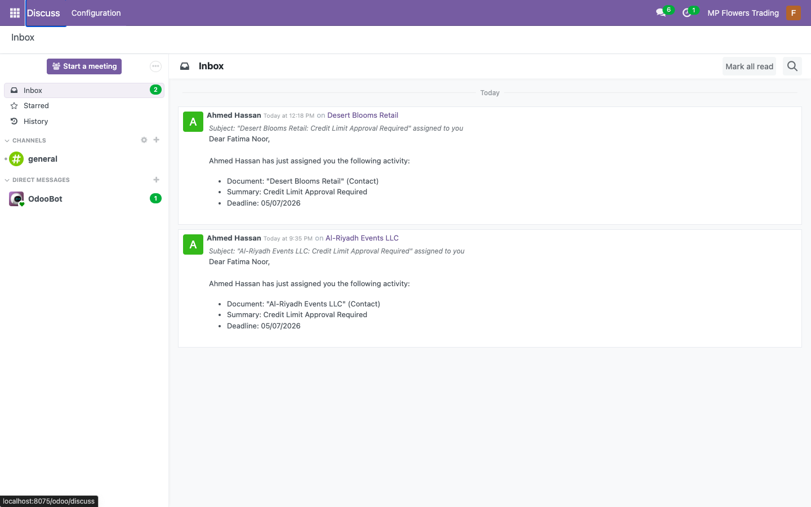
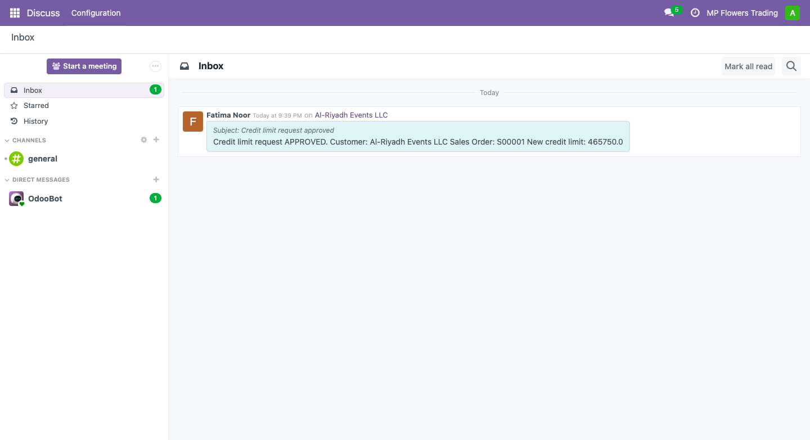
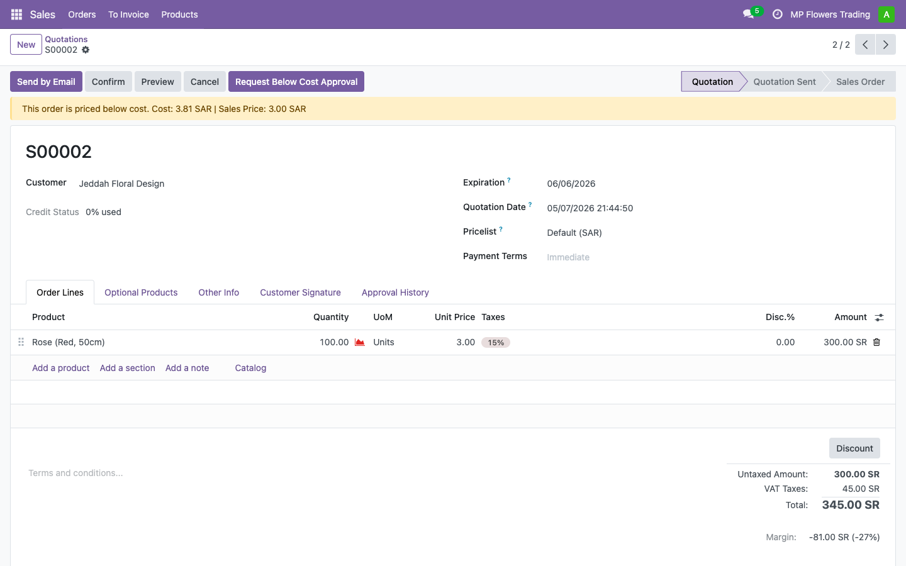
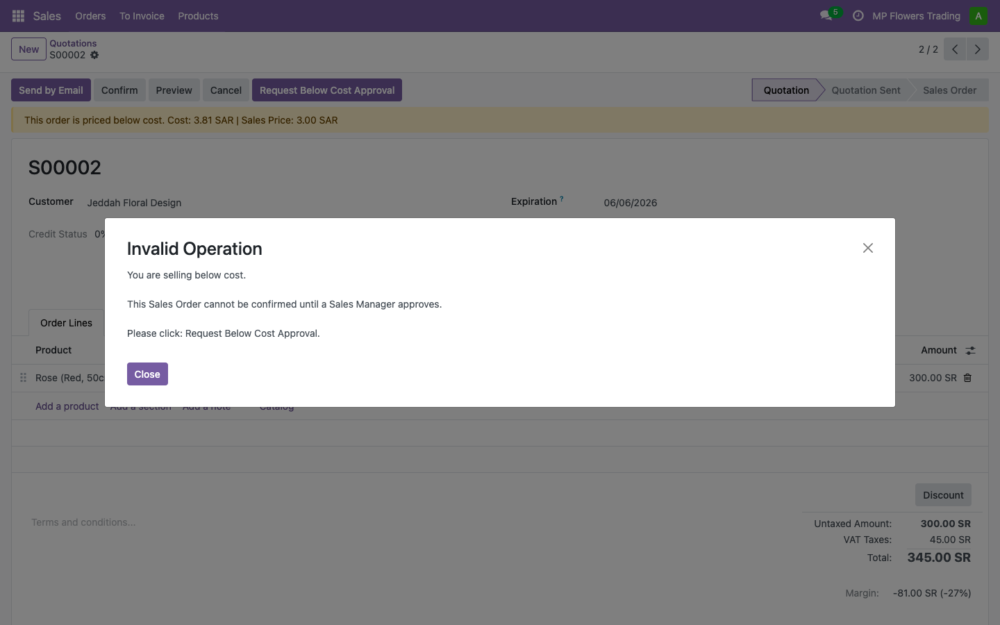
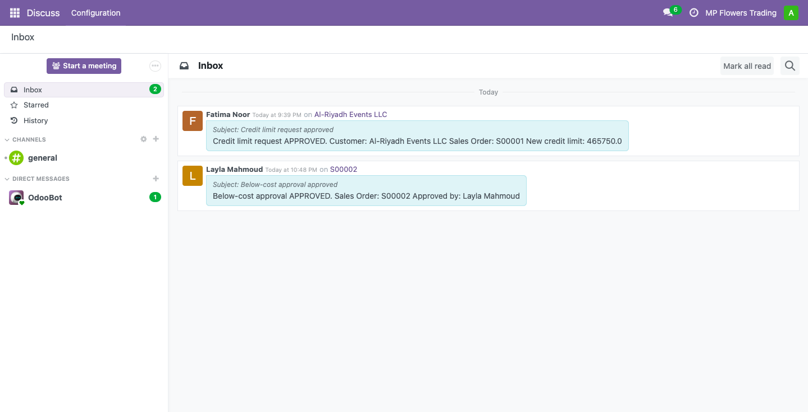

# odoo18-sales-credit-control

An Odoo 18 module that enforces credit limits and below-cost pricing governance on Sales Orders — with role-based approval workflows, automated notifications, and a full audit trail.


Built on Odoo 18 Community. Tested with the Sales, Accounting, and Inventory apps.

---

## Table of Contents

- [What It Does](#what-it-does)
- [Screenshots](#screenshots)
- [Module Structure](#module-structure)
- [Security Groups](#security-groups)
- [Credit Tiers](#credit-tiers)
- [Installation](#installation)
- [Workflow Overview](#workflow-overview)
- [Configuration Settings](#configuration-settings)
- [Technical Notes](#technical-notes)
- [License](#license)
- [Author](#author)

---

## What It Does

### Credit Control

- Assigns customers to credit tiers (Gold, Silver, Bronze, New Customer), each with a configurable default credit limit
- New customers go through an initial credit setup — the salesperson selects a tier and requests a limit, which the Accounting team approves before any Sales Order can be confirmed
- Blocks Sales Order confirmation when a customer's total exposure exceeds their approved limit
- Gives the salesperson a one-click **Request Credit Increase** flow — the request routes to Accounting for approval
- Notifies the salesperson automatically when the request is approved or rejected
- Tracks the full approval history on both the customer record and the Sales Order

### Below-Cost Governance

- Detects when any Sales Order line is priced below the product's current cost (post landed costs)
- Blocks confirmation and prompts the salesperson to request approval from a Pricing Manager
- The Pricing Manager sees **Approve Below Cost** / **Reject Below Cost** buttons directly on the SO
- Rejection requires a written reason, keeping the audit trail clean

---

## Screenshots

### Credit Setup Tab — New Customer Onboarding


The Credit Setup tab on the customer form. Salesperson selects a credit tier and clicks Request Credit Limit to start the approval flow.

### Initial Credit Request — Accounting Team Review


The Accounting team receives an inbox notification and reviews the request on the Credit Approval tab before the customer can place any orders.

### Credit Limit Exceeded — SO Blocked


A warning banner shows the exact overage amount. Clicking Confirm raises a validation error until the credit increase is approved.

### Request Credit Increase Wizard


Salesperson fills in the requested limit and reason. One click sends the request to the Accounting team inbox.

### Credit Approval Pending


The Sales Order reflects the pending state. The salesperson can track the request status without leaving the SO.

### Accountant Inbox — Approval Request


The Accounting user sees the request in their inbox with the requested amount, current limit, and reason provided.

### Sales User Notified — Credit Approved


Once approved, the salesperson receives a notification and can confirm the Sales Order immediately.

### Below-Cost Warning Banner


The banner shows cost vs. sale price for every affected line. The salesperson can see the margin impact before requesting approval.

### Below-Cost Blocked — Validation Error


Clicking Confirm raises a clear validation error. The SO cannot proceed without Pricing Manager approval.

### Below-Cost Approved — Sales User Notified


The Pricing Manager approves or rejects directly on the SO. The salesperson is notified either way.

---

## Module Structure

```
sales_credit_control/
├── __manifest__.py
├── __init__.py
├── models/
│   ├── __init__.py
│   ├── res_partner.py            # Credit tier, limit, approval tab on customer
│   ├── sale_order.py             # Blocking logic, request wizards, banner
│   └── approval_reason.py        # reason_type_credit proxy field
├── wizard/
│   ├── __init__.py
│   ├── credit_request_wizard.py  # Request Credit Increase wizard
│   └── below_cost_wizard.py      # Request Below Cost Approval wizard
├── views/
│   ├── res_partner_views.xml
│   ├── sale_order_views.xml
│   └── approval_reason_views.xml # Separate form views per reason type
├── security/
│   └── ir.model.access.csv
└── static/src/img/screenshots/
```

---

## Security Groups

| Group | Technical Name | Who Gets It |
|---|---|---|
| Credit Setup Requestor | `group_credit_setup_requestor` | Salesperson — can request credit limits and increases |
| Credit Config Manager | `group_credit_config_manager` | Accounting team — approves or rejects credit requests |
| Pricing Config Manager | `group_pricing_config_manager` | Pricing/Sales Manager — approves or rejects below-cost orders |

---

## Credit Tiers

Configure tiers under **Invoicing → Configuration → Credit Control → Credit Tiers**.

| Tier | Suggested Default Limit |
|---|---|
| Gold | 500,000 |
| Silver | 200,000 |
| Bronze | 75,000 |
| New Customer | 15,000 |

Each customer is assigned a tier on the **Credit Setup** tab. The salesperson requests the initial limit, which the Accounting team approves on the **Credit Approval** tab.

---

## Installation

**Prerequisites:** Sales must be installed before this module. Accounting and Inventory are also required (listed in `depends`).

```bash
git clone https://github.com/mayuri2392/odoo18-sales-credit-control ~/Projects/odoo18/custom_addons/sales_credit_control
```

Restart Odoo, enable developer mode, then install **Sales Credit Control** from the Apps menu.

**Post-install configuration:**

1. Configure credit tiers under **Invoicing → Configuration → Credit Control → Credit Tiers**
2. Add credit reasons under **Invoicing → Configuration → Credit Control → Credit Reasons**
3. Add below-cost rejection reasons under **Sales → Configuration → Below-Cost Reasons**
4. Enable enforcement under **Sales → Configuration → Settings → Credit Control**

> Credit Tiers and Credit Reasons appear under the Invoicing menu, not Sales. This is intentional — credit governance sits with the Accounting team.

---

## Workflow Overview

### Initial Customer Credit Setup

1. Salesperson opens a new customer → **Credit Setup** tab → selects a Credit Tier → clicks **Request Credit Limit**
2. Accounting team receives an inbox notification → opens **Credit Approval** tab → clicks **Approve**
3. Salesperson is notified. The customer is now cleared for Sales Orders.

### Credit Blocking Flow

1. Salesperson creates a Sales Order that exceeds the customer's approved credit limit
2. A warning banner appears on the SO showing the exact overage amount
3. Clicking **Confirm** raises a validation error — the SO cannot be confirmed until the limit is raised
4. Salesperson clicks **Request Credit Increase** → fills in the requested limit and reason → submits
5. Accounting team receives an inbox notification → approves or rejects
6. Salesperson is notified. If approved, the SO can now be confirmed.

### Below-Cost Flow

1. Salesperson prices a product below its current cost (post landed costs)
2. A warning banner appears: "This order is priced below cost. Cost: X | Sales Price: Y"
3. Clicking **Confirm** raises a validation error — the SO cannot proceed without manager approval
4. Salesperson clicks **Request Below Cost Approval** → submits
5. Pricing Manager sees **Approve Below Cost** / **Reject Below Cost** buttons directly on the SO
6. Salesperson is notified. If approved, the SO can now be confirmed.

---

## Configuration Settings

Under **Sales → Configuration → Settings → Credit Control**:

| Setting | Effect |
|---|---|
| Enforce Credit Blocking | Blocks SO confirmation when the credit limit is exceeded |
| Enforce Below Cost Approval | Blocks SO confirmation when any line is priced below cost |

Both settings are off by default. Enable them per company.

---

## Technical Notes

- `'application': False` — this is a functional module, not a standalone app. The Sales app must be installed first.
- Admin users bypass group checks by design (Odoo standard behaviour). Use role-specific users to demo the approval flows.
- The `reason_type_credit` proxy field on `approval.reason` restricts the Credit Reasons form to credit-only options, keeping the UI clean for Accounting users. Below-Cost Reasons are managed separately under Sales → Configuration.
- `om_account_followup` warning on startup is harmless — fix is `default=lambda self: _('Invoices Reminder')` in `followup_print.py` line 34 if needed.
- Compatible with Odoo 18 Community. No Docker required for local development.

---

## License

[LGPL-3](LICENSE)

---

## Author

**Mayuri Patil** — Odoo Functional + Technical Consultant

6 years across B2B retail, logistics, and perishable goods. Open to EU roles.

[](https://linkedin.com/in/mayuri-patil-2392)
[](https://github.com/mayuri2392)